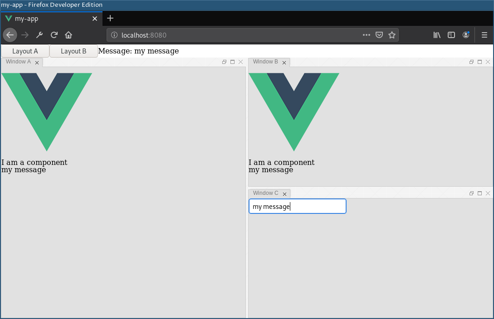

# vue-cli-goldenlayout

This is an example of how to combine [Vue 2](https://vuejs.org/) and [GoldenLayout](https://golden-layout.com/).

This project uses [Vue CLI](https://cli.vuejs.org/) with TypeScript.

The app.vue element holds the goldenlayout instance; and every goldenlayout container contains a vue element specified by name in the layout config.

